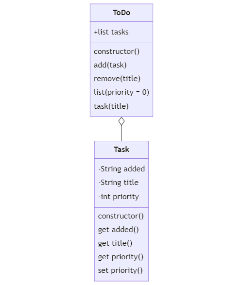
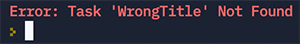

# Task 3 - ToDo App 


## You are required to:  
 
* Create a minimum viable product (MVP) ToDo App  - the system will be object-oriented with two classes (```Task``` and ```ToDo```).  The ```ToDo``` class will provide simple storage, management (i.e., add, remove, list and access any specific ```Task```). This will be a _1-to-many_ relationship (one ```ToDo``` instance supports many ```Task``` instances). 


## Creating the helper functions

* To support your system you will also need to implement a number of supportive functions:
    * Create the ```valid_integer``` function. The function should accept a string or numeric value and return a boolean indicating whether the 'value' can be represented as a positive integer.   
    * Create the ```validate_priority``` function. The function should accept a string or numeric value and return a validated priority (type integer). Valid priorities are 1 (LOW), 3 (MEDIUM), 5 (HIGH) and 7 (URGENT) - these have been provided for convenience.  If the argument being passed is 'invalid' the function returns the LOW priority value. 
    * Create the ```todays_date``` function. When called, this function returns a string value representing the system's 'now' datetime. It is returned in the format 'dd/mm/yyyy hh:mm:ss'.
    


# Class Diagram - ToDo App



## Creating the Classes

* Create the ```Task``` Class. The class supports 3 attributes (aka properties) and 1 method (the constructor). Where possible, the attributes should be PRIVATE. When instantiated, the ```Task``` class creates a ```Task``` object based on arguments passed, the 'added' attributed is automatically assigned as part of the constructor. The class only supports valid priorities. 


**_Pseudocode Example_**

```
task = new Task('Get Cappuccino', PRIORITY['MEDIUM'])  // Creates an instance of a Task (named task)
task.added -> '30/4/2023 12:26:26' // Checking the 'added' attribute of a Task instance returns the date/time it was added.
task.title -> 'Get Cappuccino' // Checking the 'title' attribute for a Task instance returns the title of the task.'
task.priority -> 3 // Checking the 'priority' attribute for a Task instance returns an integer 3 (Remember MEDIUM == 3).
task.priority = PRIORITY['URGENT'] // Setting the 'priority' attribute for a Task instance to URGENT (Remember URGENT == 7).
task.priority -> 7 // Checking the 'priority' attribute for a Task instance returns an integer 7 (Remember URGENT == 7).
task.priority = '10' // Setting the 'priority' attribute for a Task instance to the string '10' (an invalid priority).
task.priority -> 1 // Checking the 'priority attribute for a Task instance returns an integer 1 (because '10' was an invalid priority so it defaults to 1).
```


* Create the ```ToDo``` Class. The class must support 5 methods: (1) constructor, (2) add, (3) remove, (4) list and (5) task.
* The **constructor** should initialise an empty list/array data structure called **tasks** as an array or list. This data structure will be used to hold all the ```Task``` objects managed by the ```ToDo``` instance.
* The ```add``` method will be used to append (push) a passed Task instance into the ```tasks``` array. The method is expected to return the total number of Tasks now held in the array (i.e., length of ```tasks```).
* The ```remove``` method expects a single 'string' argument (a valid Task 'title') and (if found) removes (pops) that specific ```Task``` instance from the ```tasks``` array.  The method returns a boolean value depending on whether a valid Task was removed (reducing the overall number of Tasks now managed by the ```ToDo``` instance).
* The ```list``` method provides support for an optional ( default value = 0 ) single integer argument (valid values are 0 for ALL tasks or a valid priority) and returns a list (aka an array, in this instance a list of lists) of all matched 'current' tasks (required format: task.added, task.title, task.priority). If a specific priority (e.g., 7 or PRIORITY [ 'URGENT' ] ) was specified only tasks with that priority will be returned.
* The ```task``` method provides access (as a reference) to a specific ```Task``` instance managed by the ```ToDo``` class. The method expects a single 'string' argument (title) and uses that to search for a matching task – if found a reference is returned that can be used to directly modify the Task instance priority – if not matched an error is thrown (aka 'raised') in the format: ```Task '<title>' Not Found```. (As part of your own testing you may find it useful to use a try/catch statement when dealing with this type of behaviour).


**_ToDo Pseudocode Example_**
```
task_list = new ToDo () // Creates an instance of ToDo named task_list
task_list.add (Task( 'Get Cappuccino', PRIORITY [ 'HIGH' ]) ) -> 1  // Adds a new Task instance to the task_list instance and returns the number of tasks in the list: (1) in this case.
task_list.add (Task( 'Order Lunch', PRIORITY [ 'MEDIUM' ]) ) -> 2 // Adds a second Task instance to the task_list instance and returns the number of tasks in the list: (2) now.
task_list.add (Task( 'Complete Project Sprint', PRIORITY [ 'MEDIUM' ]) ) -> 3 // Adds a third Task instance to the task_list instance and returns the number of tasks in the list: (3) now. 
task_list.list (PRIORITY [ 'MEDIUM' ] ) ->  // Calls the list method of the task_list instance and a list of lists is returned with all the MEDIUM priority tasks.
  [
    [ '28/3/2023 10:16:56', 'Order Lunch', 3 ], 
    [ '28/3/2023 10:16:56', 'Complete Project Sprint', 3 ]
  ]
taskList.list ( PRIORITY['HIGH'] ) ->  //  Calls the list method of the task_list instance and a list of lists is returned with all the HIGH priority tasks.
  [
    [ '28/3/2023 10:16:56', 'Get Cappuccino', 5 ]
  ]
task_list.task ('Complete Project Sprint').priority = PRIORITY['HIGH'] // Changes a specific task to have a HIGH priority.
task_list.list ( PRIORITY['HIGH'] ) // Calls the list method of the task_list instance and a list of lists is returned with all the HIGH priority tasks.
  [
    [ '28/3/2023 10:16:56', 'Get Cappuccino', 5 ], 
    [ '28/3/2023 10:16:56', 'Complete Project Sprint', 5 ]
  ]
task_list.list ( PRIORITY['HIGH'] ) [0] [1] -> 'Get Cappuccino'   // Calls the list method of the taskList instance and accesses the [0][1] position of the object, returning the task name.
task_list.remove ( 'Complete Project Sprint1' ) -> false  // Calls the remove method and 'false' is returned, as a task with this name doesn't exist.
task_list.remove ( 'Complete Project Sprint' ) -> true // Calls the remove method and 'true' is returned, as a task with this name DOES exist.
task_list.list ( PRIORITY['HIGH'] ) -> //  Calls the list method of the task_list instance and a list of lists is returned with all the HIGH priority tasks. (Only one now)
  [
    [ '28/3/2023 10:16:56', 'Get Cappuccino', 5 ], 
  ]
task_list.task ( 'WrongTitle' ) -> // throw error <Task 'WrongTitle' Not Found> as task with this name doesn't exist.
```




#### Additional Guidance

* Create and test the three supporting functions first.
* It is worth remembering that, when instantiated, a ToDo object is simply a management container for any number of added Tasks.
* Defining and declaring PRIVATE variables - typically the idea of 'scope' is used to keep 'things safe' and prevent unexpected or 'unauthorised' values being accessible, used 'as is' or accidentally overridden. However, within the context of OO (object oriented) design there is the concept of 'accessors' - essentially these abstract (hide) implementation details in three (general ways): public (i.e., exposed to the wider codebase), protected (i.e., exposed to 'trusted or extended' aspects of the codebase) and private (only available from 'within' the local code base). 

* Evidence of your own testing is expected. You should test your solution by making sufficient calls to your function(s)/Classes so that you are positive that it works as expected. These should be left at the bottom of ```oop.py``` **commented out**. 

* Your final version should demonstrate evidence of being refactored; please note, refactoring is not bug-fixing - essentially it is reducing complexity and simplifying your codebase such that it is as efficient, readable, structured and as manageable as possible.

Some example calls to the functions and methods you will write:

```python
valid_integer ( '10' ) // returns True
valid_integer ( 10 ) // returns True 
valid_integer ( '-10' ) // returns False
valid_integer ( -10 ) // returns False
valid_integer ( 0.0 ) // returns False
valid_integer ( 10.0 ) // returns False
valid_integer ( -10.0 ) // returns False
validate_priority ( 0 ) // returns 1
validate_priority ( 1 ) // returns 1
validate_priority ( 'A' ) // returns 1
validate_priority ( '7' ) // returns 7
validate_priority ( '10' ) // returns 1
todays_date() // returns the current date and time, whatever it is. E.g. 28/03/2024 09:30:06 


const task_list = new ToDo() // creates an instance of a ToDo() object name task_list
task_list.add(new Task ('Get Pasta', PRIORITY ['MEDIUM'])) // returns 1 as 1 task in list
task_list.add (new Task ('Get Breakfast Cereal', PRIORITY ['MEDIUM'] )) // returns 2 as 2 tasks in list
task_list.remove ('Get Breakfast Cereal') // returns true (as task exists, and then removes it)
```


## Submission Checklist

Prior to actually submitting your final attempt you should ensure you have reviewed and considered the following checklist.

  
  1. Refactored solution.
  2. Does your solution follow accepted coding conventions?
  3. Your 'test' code, commented out at the bottom of ```oop.py```