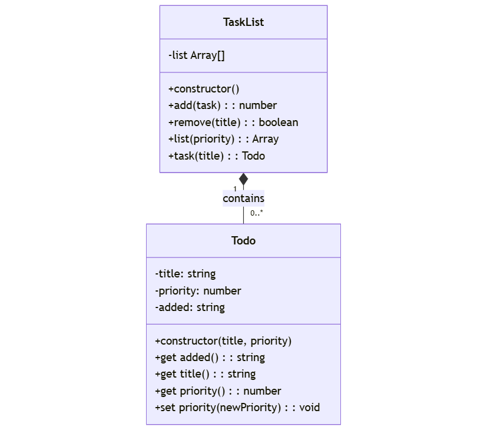

# TaskList App

A minimum viable product (MVP) Tasklist application implementing an object-oriented design with two main classes.

## Overview

The application consists of two key classes that work together:

- `TaskList`: Manages a collection of task items
- `Task`: Represents individual task items

The relationship between these classes is one-to-many: a single `TaskList` instance can manage multiple `Task` instances.

## Class Diagram



## Helper Functions

The system requires three helper functions:

### 1. `valid_positive_integer(value)`
- **Accepts**: string or numeric value
- **Returns**: boolean
- **Purpose**: Validates if the input can be represented as a positive integer

```python
valid_positive_integer('10')  # returns True
valid_positive_integer(10)    # returns True
valid_positive_integer('-10') # returns False
valid_positive_integer(0.0)   # returns False
```

### 2. `validate_priority(value)`
- **Accepts**: string or numeric value
- **Returns**: integer (priority value)
- **Valid priorities**:
  - LOW (1)
  - MEDIUM (3)
  - HIGH (5)
  - URGENT (7)
- **Returns LOW (1)** for invalid inputs

```python
validate_priority(1)    # returns 1
validate_priority('7')  # returns 7
validate_priority('A')  # returns 1 (invalid input)
```

### 3. `todays_date()`
- **Returns**: string
- **Format**: 'DD/MM/YYYY HH:MM:SS'
- **Purpose**: Provides current system datetime

```python
todays_date()  # returns current date and time e.g., "23/06/2025 09:30:04"
```

## Class Specifications

### `Task` Class

Represents a single task item with three private attributes:
- `_title`
- `_priority`
- `_added` (automatically set on creation)

#### Example Usage:
```python
task = Task('Get Cappuccino', PRIORITY['MEDIUM']) # Instantiates a new instance of Task, named 'task'
print(task.added)    # '23/10/2024 12:26:26'
print(task.title)    # 'Get Cappuccino'
print(task.priority) # 3
task.priority = PRIORITY['URGENT']
print(task.priority) # 7
```

### `TaskList` Class

Manages a collection of `Task` items with four main methods:

1. **`add(task)`**:
   - Adds a `Task` instance to the list.
   - **Returns**: Number of tasks in the list.

2. **`remove(title)`**:
   - Removes a task by title (case sensitive).
   - **Returns**: boolean (`True` if removed, `False` if not found).

3. **`list(priority=0)`**:
   - Lists tasks, optionally filtered by priority.
   - **Returns**: List of `[added, title, priority]` lists.
   - Priority `0` returns all tasks.

4. **`get_task(title)`**:
   - Retrieves a specific task by title.
   - **Returns**: `Task` reference if found.
   - **Raises**: `ValueError` if not found (`Task 'title' Not Found`).

#### Example Usage:
```python
task_list = TaskList()
task_list.add(Task('Get Cappuccino', PRIORITY['HIGH']))     # returns 1
task_list.add(Task('Order Lunch', PRIORITY['MEDIUM']))      # returns 2
print(task_list.list(PRIORITY['MEDIUM']))                  # returns matching tasks
task_list.get_task('Order Lunch').priority = PRIORITY['HIGH']   # updates priority
print(task_list.remove('Order Lunch'))                     # returns True
```

## Development Guidelines

1. Implement and test helper functions first.
2. Use private attributes (prefix with `_`) where possible.
3. Refactor for clarity and efficiency.
4. Follow standard Python coding conventions.

---

### Python-Specific Notes:
- Use `@property` decorators for getters and setters.
- Use `datetime` module for date formatting.
- Use `raise ValueError` for error handling.
- Use a list for storing tasks.